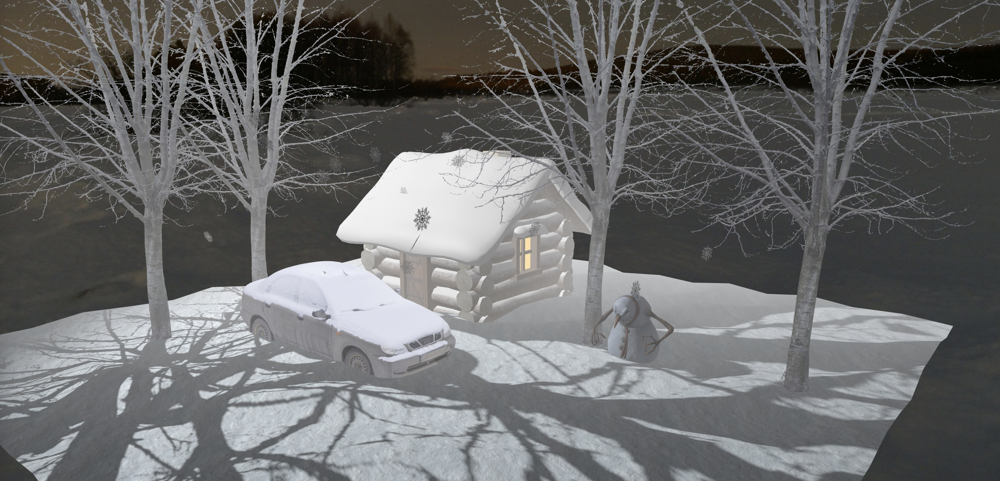

<h2>About the project</h2>
<h3>❄️ Dark Winter Scene ❄️</h3>

The original winter-themed visualization was created on Three.js. The project contains a scene with 3D animated models. The project used raycasting for the selected action, as well as using buttons to select actions and adding music control to the scene. 

<h3>Build with:</h3>

» HTML / CSS  
» THREE.JS

<h2>Screenshots of the Project 📸</h2>
 

